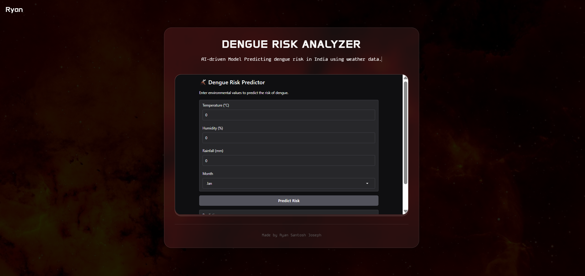

# Dengue Prediction Interface 🌡️

[](https://dengue-risk-analyzer.vercel.app/)
[](LICENSE)

A modern AI-powered interface for predicting dengue outbreak risks using weather parameters. Features a glass-morphism design and direct integration with Hugging Face's ML models.



## Key Features ✨

- **Neural Design Aesthetic**  
  Cyberpunk-inspired UI with dynamic glass effects
- **Real-time Predictions**  
  Integrated with Hugging Face disease prediction model
- **Responsive Layout**  
  Optimized for desktop and mobile devices
- **Typewriter Animation**  
  Dynamic text effects for model description

## Tech Stack 🛠️


## Live Deployment 🚀

**Experience the interface:**  
[](https://dengue-risk-analyzer.vercel.app/)

<a href="https://dengue-risk-analyzer.vercel.app/">
  
</a>

## Development Setup 💻

```bash
# Clone repository
git clone https://github.com/RyanSantoshJoseph/Dengue-Risk-Analyzer.git

# Navigate to project
cd Dengue-Risk-Analyzer

# Launch local server (Python 3)
python3 -m http.server 8000
